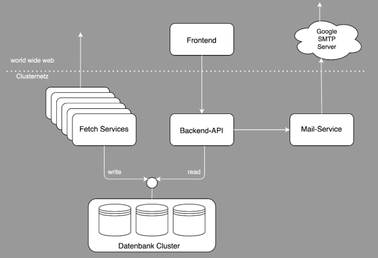

## City-Data-Visualizer

City Data Visualizer provides helpful visualizations for complex health data. With the help of open data, we hope to give both Berlin's administration, scientists and residents a better understanding of current health risks or positive impacts that are occurring in the city.

### Architecture


### How to build & run

In our project folder run:
```console
npm install
npm run serve
```

Alternatively you can use Docker:
```console
docker build -t visualizer-fe:local .
docker run -p 8090:8090 visualizer-fe:local
```

### How to deploy

CI/CD: By pushing on the master branch, our Github Action automatically deploys the web application.

### Tools / Frameworks being used

Frontend:
- Vue.js, apexchart, leaflet

Backend:
- CouchDB, Flask, pycouchdb, pandas, numpy

DevOps:
- Kubernetes, Docker, Github Actions

### Resources

- Scrum board: https://github.com/orgs/Api-visualizer/projects/1
- Frontend prototype: https://www.figma.com/file/akn5Z8GM9RSuhkAmzLinr0/Untitled?node-id=0%3A1

### Release
- Final product: https://city-data.app.datexis.com/
- Release frontend: https://github.com/Api-visualizer/city-data-visualizer-FE/tree/main
- Release backend: https://github.com/Api-visualizer/city-data-visualizer-BE/tree/main

___________________
###### note - disclaimer

######Because of a cluster incident on Jan 4th 2020 - 18 hours before deadline - we lost some data, we've fetched daily via cronjobs. We tried to reproduce the data and the production system of the last 4 Weeks within 11 hours but it was too late. 

######It's like anyone wanted us to learn, that automated backups are a good idea.

######Lesson learned.

######therefore the production system has got missing dates between 12.12.2020 and 04.02.2021. this affects the covid infection map and the barchart about covid per agegroup.


